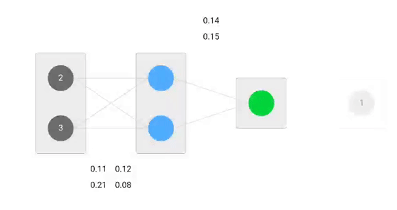

# netflow.js
**netflow.js** is a javascript library for visualizing neural network structure and training on the browser. 

The library is ment to be used for explanation purposes. 

You can see a demo [here](https://hmkcode.com/netflow/)




powered by [p5.js](https://p5js.org/).


## Getting Started:

**netflow.js** is splited into multiple js files. You need to add the js files as shown below to your html file. 

**netflow.js** depends on [`p5.js`](https://p5js.org/) library for drawing on the html canvas. 

```html
<html>
  <head>
    <link rel="stylesheet" type="text/css" href="css/style.css">
    
    <script src="js/lib/p5.min.js"></script>
    <script src="js/values/style.js"></script>
    <script src="js/values/dimes.js"></script>
    <script src="js/utils/helper.js"></script>
    <script src="js/core/activation.js"></script>
    <script src="js/core/view.js"></script>
    <script src="js/core/draw.js"></script>
    <script src="js/core/netflow.js"></script>
    <script src="js/builder.js"></script>

  </head>
  <body>
    
  </body>
</html>
```
## Building a Neural Network

To build a neural network, go to `builder.js` 

Below is a sample 3-layer (input (2), hidden (2) and output (1) ) neural network. 
The first added layer is always the **input** layer, while the last is the **output**. Any layer added in between is a hidden layer.

```javascript
function build(){
    var net = new Net();

    net.addLayer(2); // input 
    net.addLayer(2); // hidden
    net.addLayer(1); // output

    return net;

}

```
## Viewing the Built Neural Network

- Open `index.html` in the browser to view the built network. 
- To run the forward pass and backpropagation click on the button on the top left corner or press space bar. 


## Adjusting the Speed

- To adjust the learning speed go to `dimes.js.
- Change the value of `DELAY` variable. 
- The value is in milliseconds.

## Adding Activation Function

- You can add an activation function to a layer while building the network in `builder.js` file.

```javascript
function build(){
    var net = new Net();

    net.addLayer(2); // input 
    net.addLayer(2, ReLu); // hidden with activation function
    net.addLayer(1); // output

    return net;

}

```


